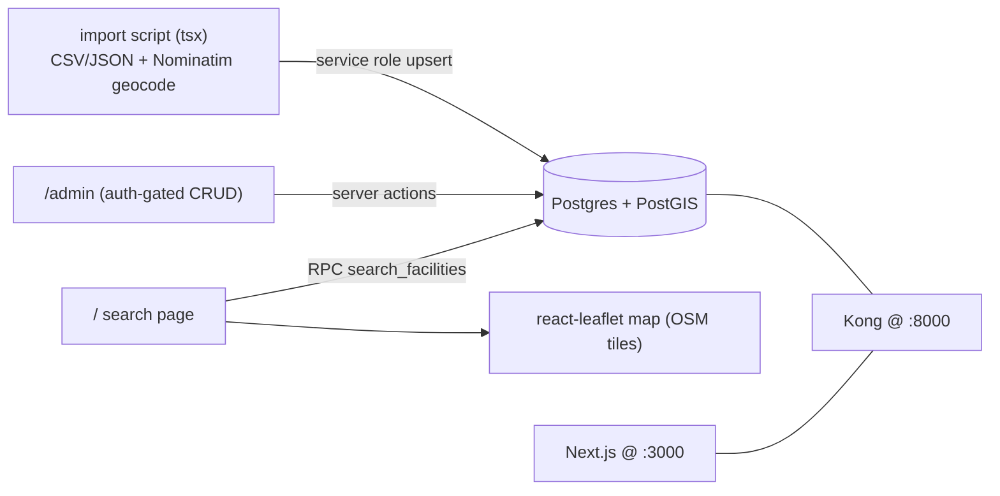
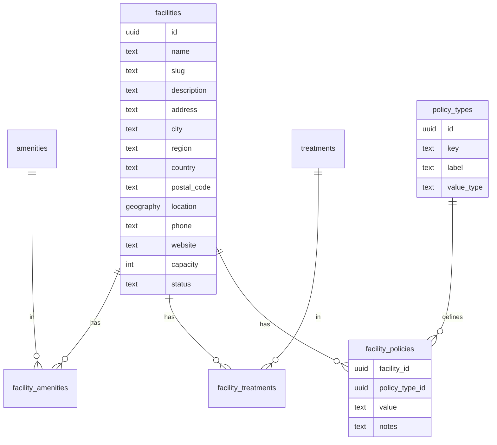

# RecoverySearch Web App

## Context
- Self-hosted Supabase already runs via Docker: Kong gateway at `http://localhost:8000`, Postgres at `localhost:5432`, Studio for SQL. Keys live in [.env](.env) (`ANON_KEY`, `SERVICE_ROLE_KEY`). Intended app URL is `http://localhost:3000` (`SITE_URL`).
- No app code exists yet. We add a Next.js app in a new `web/` subfolder so it stays separate from the Supabase infra files.
- Decisions confirmed: data arrives via **bulk import/scrape + admin editing**; search must include **text + city/region filters + facet filters (policies/amenities/treatments) + map view & radius search**.

## Architecture

## Data model

- `policy_types` + `facility_policies` (value like `allowed`/`restricted`/`prohibited`/`conditional` + notes) keeps policies flexible (e.g. "phones/electronics allowed") without schema churn.
- Amenities and treatments are lookup tables with join tables for clean faceting.
- `location geography(Point,4326)` with a GiST index powers radius search via `ST_DWithin`/`ST_Distance`.

## Steps

### 1. Database schema (SQL migrations)
- Create `web/supabase/migrations/0001_init.sql`:
  - `create extension if not exists postgis;`
  - Tables above + `profiles(id, is_admin bool)` (extend the pattern in [dev/data.sql](dev/data.sql)).
  - Indexes: GiST on `facilities.location`, trigram/`pg_trgm` on `name`, btree on `city`/`region`, indexes on join tables.
  - Seed `amenities`, `treatments`, `policy_types` (incl. an electronics/phones policy) with common values.
- Create `0002_search_fn.sql` with `search_facilities(...)` RPC returning rows + `distance_m`, filtered by text (ILIKE/trgm), city/region, `amenity_ids[]`, `treatment_ids[]`, policy filters, and optional `lat/lng/radius_m`, with sort + pagination. Mark `security definer` so anon can read published rows.
- Apply via Studio SQL editor or `psql` to `localhost:5432`. Document both in README.

### 2. RLS
- `0003_rls.sql`: enable RLS; public `select` on `status='published'` facilities + all lookup/join tables; writes restricted to admins (`exists (select 1 from profiles where id=auth.uid() and is_admin)`). Import script uses `SERVICE_ROLE_KEY` (bypasses RLS).

### 3. Next.js scaffold (`web/`)
- App Router + TS + Tailwind; install `@supabase/supabase-js`, `@supabase/ssr`, `react-leaflet`, `leaflet`, `zod`, `tsx`.
- `web/lib/supabase/{client,server}.ts` (browser + server clients) and `web/proxy.ts` for session refresh, per Supabase SSR guide.
- `web/.env.local`: `NEXT_PUBLIC_SUPABASE_URL=http://localhost:8000`, `NEXT_PUBLIC_SUPABASE_ANON_KEY=<ANON_KEY>`, server-only `SUPABASE_SERVICE_ROLE_KEY=<SERVICE_ROLE_KEY>`. Generate DB types into `web/lib/database.types.ts`.

### 4. Public search experience
- `web/app/page.tsx`: server-rendered search calling the `search_facilities` RPC from URL query params.
- Components: `SearchFilters` (text, city/region, amenity/treatment/policy facets, radius slider), `FacilityList` + `FacilityCard`, `FacilityMap` (client `react-leaflet` with OSM tiles, markers + selected-radius circle), `Pagination`.
- `web/app/facilities/[slug]/page.tsx`: detail page showing policies (phones/electronics etc.), amenities, treatments, map, contact info.

### 5. Admin editing (auth-gated)
- `web/app/auth/login` using Supabase Auth (email/password).
- `web/app/admin` layout guarded by server-side admin check; CRUD for facilities and their policies/amenities/treatments via server actions with `zod` validation.

### 6. Bulk import / geocoding pipeline
- `web/scripts/import.ts` (run with `tsx`): reads CSV/JSON from `web/data/`, geocodes addresses to lat/lng via Nominatim (rate-limited, cached), maps amenity/treatment/policy names to lookup IDs, and upserts facilities (set `status='published'`) using the service-role client. Idempotent on `slug`/external id.
- Add `web/data/sample-facilities.csv` and an `import` npm script; document the CSV columns.

### 7. Docs
- `web/README.md`: env setup, applying migrations, generating types, running `npm run dev`, and running the importer.

## Notes / assumptions
- App lives in `web/` and talks to Supabase through Kong at `:8000`; no changes to existing Docker/infra files.
- Map uses free OSM tiles (no API key); geocoding uses public Nominatim (swap to a keyed provider later if volume grows).
- Search runs as a single Postgres RPC for correct, performant combined facet + geo filtering and accurate pagination.

---

## Implementation status — COMPLETED (2026-05-30)

All eight todos delivered and verified end-to-end against the running self-hosted stack. Typecheck, production build, and runtime smoke tests all pass.

### Decisions made mid-implementation (vs. original plan)
- **Package management: Nix flake + direnv** (added at user request). `web/flake.nix` provides Node 22, the Supabase CLI, and `psql`; `web/.envrc` (`use flake` + `dotenv_if_exists .env.local`) activates it. Note: nix flakes only see git-tracked files, so `web/` was `git add`-ed (no commit).
- **ORM/migrations: Supabase-native, NOT Prisma** (user confirmed). Rationale: PostGIS geography/RPC and RLS are first-class in Supabase but awkward in Prisma. We use the Supabase CLI for migrations and `gen types` for the single source of truth.
- **Migrations applied via Supabase CLI through the pooler**, not raw `psql`/Studio. Host port `5433` -> pooler -> db; connection string uses `postgres.<POOLER_TENANT_ID>` and `?sslmode=disable`. The `db` container does not publish `5432` to the host.
- **Migration files renamed** to CLI timestamp format: `20260530024100_init.sql`, `20260530024101_search_fn.sql`, `20260530024102_rls.sql` (recorded in `supabase_migrations.schema_migrations`).
- **`middleware.ts`** used for session refresh + `/admin` gating (Next.js convention) instead of `proxy.ts`.
- **`database.types.ts` is generated** from the live schema via `supabase gen types` (replaced the initial hand-written stub); a small `lib/types.ts` adds domain aliases.
- **Supabase client libs upgraded** to `@supabase/supabase-js ^2.106` and `@supabase/ssr ^0.10` to match the generated type format (the pinned older versions produced `never` types).
- Admin writes go through the **user-scoped server client** (RLS enforces `is_admin()`), not the service-role client.

### What was built
- **DB** (`web/supabase/migrations/`): PostGIS-backed `facilities` (auto-synced `geography(Point,4326)` via trigger, GiST + `pg_trgm` indexes), lookups (`amenities`, `treatments`, `policy_types`), join tables, flexible `facility_policies` (value + notes), seed data, auto-create `profiles` on signup. `search_facilities` RPC (keyword + city/region + amenity/treatment/policy facets + geo radius via `ST_DWithin`/`ST_Distance`, `distance_m`, sort, windowed `total_count`). RLS via `is_admin()` helper.
- **App** (Next.js 15 App Router, TS, Tailwind v4): public search `/` (filters incl. "Use my location" radius + map + cards + pagination), detail `/facilities/[slug]`, auth `/auth/login` + server actions, admin-gated CRUD under `/admin` (zod-validated server actions), `middleware.ts` session/guard.
- **Import**: `web/scripts/import.ts` (CSV -> Nominatim geocode w/ cache -> service-role upsert idempotent on `slug`) + `web/data/sample-facilities.csv` (6 facilities loaded).
- **Docs**: `web/README.md` (nix/direnv setup, env, CLI migrations/type-gen, dev, import, admin-user promotion).

### Verification
- `npm run typecheck` clean; `npm run build` succeeds (all routes dynamic, middleware bundled); no linter errors.
- Migrations applied + recorded via `supabase db push`; types regenerated via `supabase gen types`.
- Sample import: 6/6 facilities upserted. RPC checks: geo radius (LA 400km -> Serenity Ridge @23.6km), treatment facet (dual-diagnosis -> 2), policy facet (`electronics_allowed` -> Lakeside).
- Runtime smoke (prod server): `/` renders results + distance badges, `/facilities/[slug]` shows policies/treatments/amenities, `/auth/login` renders, `/admin` returns 307 -> `/auth/login`.

### Follow-ups / caveats
- `web/.env.local` holds real anon/service-role keys + DB password (gitignored). Rotate before any non-local deployment.
- `POOLER_TENANT_ID` is the default `your-tenant-id`; update if the pooler tenant changes.
- Admin access requires manually setting `profiles.is_admin = true` for a user.
- Nominatim geocoding is rate-limited (1 req/sec); swap to a keyed provider for large imports.