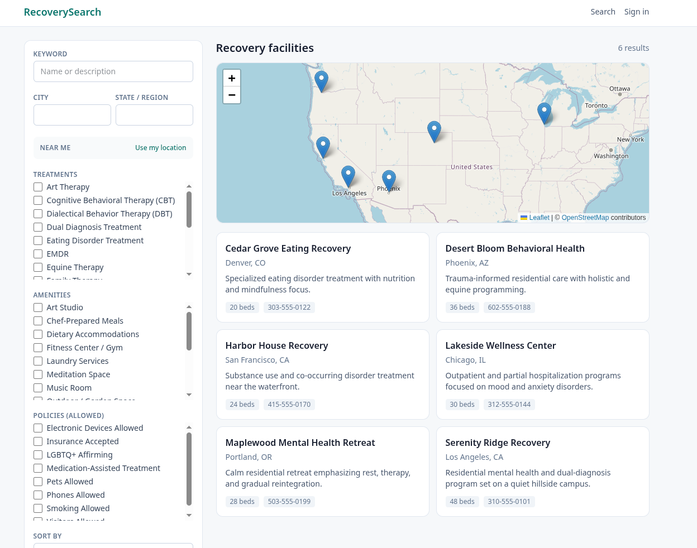

# RecoverySearch

A web application for searching and indexing mental health and addiction recovery
facilities. Filter by location, treatments, amenities, and policies, with an
interactive map powered by PostGIS geographic search.



## Documentation

- **[Web app →](web/README.md)** — Next.js setup, migrations, importing
  facilities, admin access, and project layout.
- **[Supabase / Docker setup →](SUPABASE.md)** — Self-hosted Supabase stack
  (Docker Compose) that the app runs on top of.

## Tech stack

| Concern | Choice |
| --- | --- |
| Framework | Next.js 15 App Router, TypeScript, Tailwind CSS v4 |
| Data + auth | Supabase (PostgREST, Auth, RLS), self-hosted via Docker |
| Search | Postgres `search_facilities` RPC over PostGIS |
| Map | `react-leaflet` + OpenStreetMap (no API key required) |
| Dev environment | Nix flake + direnv (Node 22, Supabase CLI, psql) |

## Quick start

```bash
# 1. Start the Supabase stack (from repo root).
docker compose up -d

# 2. Set up and run the web app.
cd web
direnv allow        # or: nix develop
cp .env.example .env.local   # fill in keys from the root .env
npm install
npm run db:push     # apply migrations
npm run dev         # http://localhost:3000
```

See [web/README.md](web/README.md) for full setup details.
